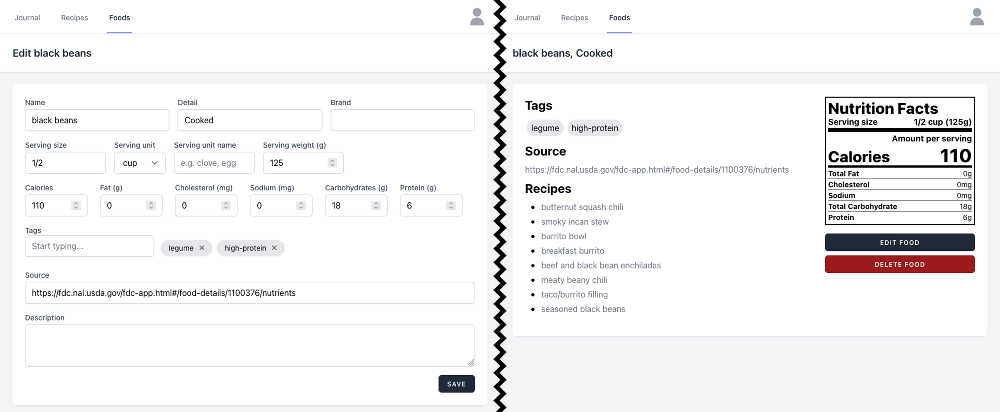
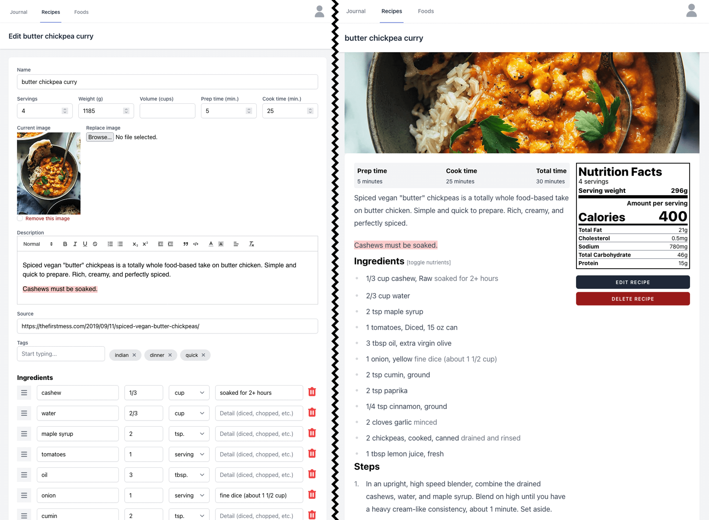
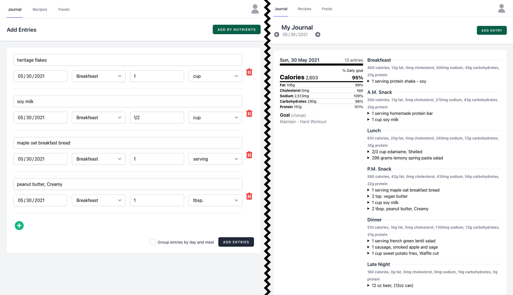
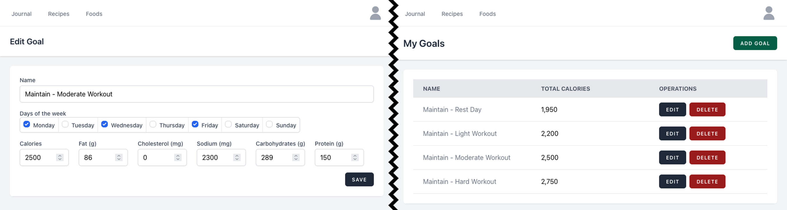
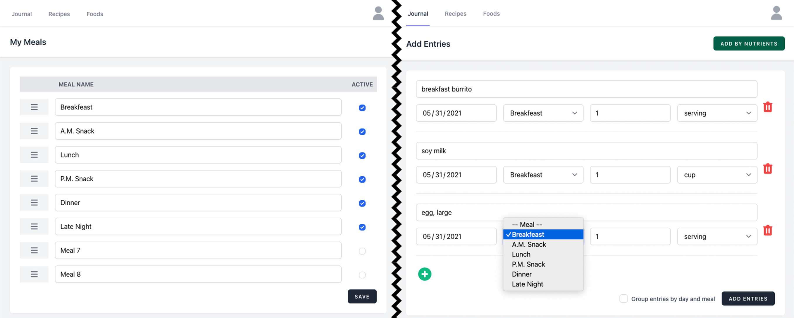

# kcal – the personal food nutrition journal

[](https://opensource.org/licenses/MPL-2.0)
[](https://github.com/kcal-app/kcal/actions/workflows/ci.yml)
[](https://coveralls.io/github/kcal-app/kcal?branch=main)

Track nutritional information about foods and recipes, set goals, and record a food
journal to help along the way. Kcal is a *personal* system that focuses on direct
control of inputs (as opposed to unwieldy user generated datasets) and a minimal,
easy to use recipe presentation for preparing meals.

## Demo

A [demo of kcal](http://demo.kcal.cooking) is available on Heroku. Login credentials are:

- Username: `kcal`
- Password: `kcal`

The demo instance resets every hour, on the hour.

## Screenshots


## Functionality

Kcal's primary functionality includes three main content categories -- journal,
recipes, and foods -- and two per-user configurations -- goals and meals. Users
can customize meals (up to eight per day) for meal planning, set multiple
goals for tracking calories and macros (fat, carbohydrates, protein), enter food
data with calories and macros, create recipes based on foods and other recipes,
and record foods and recipes in a journal tracked against goals.

### Foods

Foods are shared between all users.

Foods are the basis for recipes and calorie and macro calculations throughout the
app. They can be added directly to journal entries and included in recipes that
roll-up nutritional data per serving.

Food servings can be recorded using U.S. measure units (teaspoon, tablespoon, cup)
and use a weight basis of grams. These units and weights are commonly used in the
United States and required by law for most packaged foods. Kcal tries to make data
entry as easy as possible by organization field order and units to match nutritional
label configurations.

Food data does not (currently) make use of any API or service for retrieving
information about food. While this may change in the future, there are a couple
of reason this feature has been left out of kcal:

 - There is a very large volume of data in most food databases such that organizing,
   categorizing, and searching for the right food can be daunting.

 - Food databases that allow and include input from large groups of users can be
   inaccurate and counter-productive for users with calorie and/or macro goals.
   
 - Kcal's self-hostable nature is in part for privacy-conscious users so limiting
   interactions with third-party services is desirable (though adding APIs as an
   optional enhancement is not a major concern here).

Foods are taggable and tags can be used to filter and search for foods quickly.



### Recipes

Recipes are shared between all users. They (currently) cannot be shared externally,
but a feature enhancement to support optional, per-recipe public link creation is
planned.

Configurable recipe metadata includes servings, weight, volume, timing, image,
description, ingredients, and steps.

The recipe view is meant to be as uncluttered as possible, to support browser
"reader mode", and to still provide nutritional metadata at a glance.

Recipes are taggable and tags can be used to filter and search for recipes quickly.



### Journal entries

Journal entries are private. Each user has and can only see their own entries.

Planning and tracking calories and macros is the primary focus of journal entries.
The journal section aggregates this information by day and by meal.

Recipes and foods can be added to journal entries in various quantities and configurations
(depending on the associated serving data). Manual entries can also be used to record
data for foods and recipes *not* in the kcal's database.

Journal entries are not editable. The calorie and macro information for each entry is
recorded with the entry. This allows for recoding and maintaining journal entry
data even as foods and recipes are updated.



### Goals

Goals are private. Each user can create and see only their own goals.

Goals reflect daily calories and macros and are therefore closely related to journal
entries.

Goals can be configured as "default" for specific days of the week but can also
be overridden for individual days in the journal section.

There is no limit to the number of goals a user can create.



### Meals

Meals are private. Each user can rename, arrange, and enable or disabled their
own meals.

Meals are used to aggregate data within a day in the journal section and can be
used for both meal planning and goal tracking.

There is a pre-configured maximum of eight meals for each user.



## Use cases

Kcal's primary focus is tracking nutrition (recipe management is the most important
secondary focus), so it should be a useful tool for anyone looking to implement a
specific diet. Below are some (very) broad diet types and information about how
kcal can be helpful. Kcal intentionally **does not** provide any specific dieting
guidance or recommend any particular diet or type of diet. Individual users are
expected to research and make their own plans and goals -- kcal is here to help
record and organize the data.

### Hypocaloric diets

Hypocaloric diets use [calorie restriction](https://en.wikipedia.org/wiki/Calorie_restriction)
for weight loss or other dietary management. Kcal users can create low calorie
(relative to personal regular calorie) intake goals and use the detailed nutritional
data of food and recipes and to plan meals and record caloric intake using journal
entries.

### Hypercaloric diets

Hypercaloric diets are used for weight gain and can be especially useful for building
muscle in weight training. Kcal users can create calorie goals that exceed expected
calorie burn on a day-to-day basis. For the weight training example users can create
a goal for training days and separate, lower goal for rest days. The goals can be
automated based on the day of the week and journal entries can be used to ensure
that a proper macro balance is maintained. More meals may also be helpful on a
hypercaloric diet and kcal supports up to eight meals per day.

### Plant based diets (vegetarian, vegan, etc.)

Diets that exclude animal-based products may require special attention to ensure
a proper balance of nutrients (particularly when transitioning). Kcal's goals and
food nutritional data can help to make sure that appropriate fat, carbohydrate,
and protein needs are met.

### Low-X diets

Any diet that focuses on lowering a particular nutrient can be trackable with kcal.
In addition to the macronutrients (fat, carbohydrates, and protein) foods support
cholesterol and sodium data as well. Support for other common nutrients like
saturated fats, trans fats, fiber, sugar, etc. may also be available in future
iterations.

## Deployment

Docker is the recommended deployment method. See [kcal-app/kcal-docker](https://github.com/kcal-app/kcal-docker).

General requirements for any deployment are:

 - PHP 8.x with Composer 2.x and PHP extensions: `bcmath`, `curl`, `gd`, `intl`,
   `mbstring`, `xml`, `zip`.
 - Web server/proxy (Apache, nginx, etc.)
 - Database (MySQL/MariaDB, PostgreSQL, etc.)

Optional but useful additions are:

 - [Search driver](#search-mag) (Algolia, Elasticsearch, and database supported)
 - Redis
 - [Media Storage](#media-storage) (local or AWS S3 supported)

### Docker

There is a [`Dockerfile`](Dockerfile) and automated build process to create builds
at [kcalapp/kcal](https://hub.docker.com/repository/docker/kcalapp/kcal) on Docker Hub.
See the [kcal-app/kcal-docker](https://github.com/kcal-app/kcal-docker) repository
for a Docker Compose based template and instructions.

### Heroku

[](https://heroku.com/deploy)

The default username and password for a Heroku deployment is `kcal`/`kcal`.

#### Using Heroku CLI

For a manual deploy using Heroku CLI, execute the following after initial deployment:

    heroku run php artisan migrate
    heroku run php artisan user:add
    heroku config:set APP_KEY=$(php artisan --no-ansi key:generate --show)

#### Media storage

Heroku uses an ephemeral disk. In order to maintain recipe and/or user images between
app restarts AWS can be used. See [Media Storage - AWS S3](#aws-s3) for additional
guidance.

#### Search drivers

See the [Search](#search-mag) section for information about supported drivers. Additional
environment variable configuration is necessary when using any search driver other
than the default ("null").

#### Redis Add-on

The [Heroku Redis](https://elements.heroku.com/addons/heroku-redis) add-on can be
added to the app and will work without any configuration changes. It is left out
of the default build only because it takes a very long time to provision.

### Manual

This deployment process has been tested with an Ubuntu 20.04 LTS instance with
2GB of memory which should be enough to host the app for a few regular users.
The memory is primarily needed for Elasticsearch -- See the [Search](#search-mag) 
section for other options if lower memory support is needed.

1. Add [PHP 8.x repository](https://launchpad.net/~ondrej/+archive/ubuntu/php).

        sudo apt-get install software-properties-common
        sudo add-apt-repository ppa:ondrej/php

1. Add [Elasticsearch 7.x repository](https://www.elastic.co/guide/en/elasticsearch/reference/current/deb.html).

        wget -qO - https://artifacts.elastic.co/GPG-KEY-elasticsearch | sudo apt-key add -
        echo "deb https://artifacts.elastic.co/packages/7.x/apt stable main" | sudo tee /etc/apt/sources.list.d/elastic-7.x.list

1. Update available packages.

        sudo apt-get update

1. Install dependencies.

        sudo apt-get install elasticsearch mysql-server-8.0 nginx-full php8.0 php8.0-bcmath php8.0-cli php8.0-curl php8.0-gd php8.0-intl php8.0-mbstring php8.0-mysql php8.0-redis php8.0-xml php8.0-zip redis

1. Start Elasticsearch and configure to run at start up.

        sudo systemctl start elasticsearch
        sudo systemctl enable elasticsearch

1. Install Composer.

    :rotating_light: This command runs code from a remote location as root.
    See [Download Composer](https://getcomposer.org/download/) for alternative install options.

        curl -s https://getcomposer.org/installer | sudo php -- --install-dir=/usr/local/bin/ --filename=composer

1. Clone the app repository.

        cd /var/www
        sudo mkdir kcal
        sudo chown $USER:`id -gn $USER` kcal
        cd kcal
        git clone https://github.com/kcal-app/kcal.git .

1. Configure nginx to serve the app public files.

        sudo vim /etc/nginx/conf.d/kcal.conf
        <edit config, see example below>
        sudo service nginx restart

    Example config:

        server {
            listen 80;
            server_name kcal.example.com;
            root /var/www/kcal/public;
            
            add_header X-Frame-Options "SAMEORIGIN";
            add_header X-Content-Type-Options "nosniff";
            
            index index.php;
            
            charset utf-8;
            
            location / {
                try_files $uri $uri/ /index.php?$query_string;
            }
            
            location = /favicon.ico { access_log off; log_not_found off; }
            location = /robots.txt  { access_log off; log_not_found off; }
            
            error_page 404 /index.php;
            
            location ~ \.php$ {
                fastcgi_pass unix:/var/run/php/php8.0-fpm.sock;
                fastcgi_param SCRIPT_FILENAME $realpath_root$fastcgi_script_name;
                include fastcgi_params;
            }
            
            location ~ /\.(?!well-known).* {
                deny all;
            }
        }

1. Create database user (with secure credentials!).

        sudo mysql -u root
        CREATE DATABASE `kcal`;
        CREATE USER 'kcal'@'localhost' IDENTIFIED BY 'kcal';
        GRANT ALL ON `kcal`.* TO 'kcal'@'localhost';
        FLUSH PRIVILEGES;

1. Generate an app key to use in the next step.

        php artisan --no-ansi key:generate --show

1. Copy environment config file and adjust as desired.

        cp .env.example .env

    At a minimum:
    - Set `APP_KEY` to the value generated in the previous step.
    - Set `APP_URL` to match the host configured in nginx configuration.
    - Set the `DATABASE_` values to the configured credentials.

1. Run initial app installation/bootstrap commands.

        cd /var/www/kcal
        composer install --optimize-autoloader --no-dev
        php artisan migrate
        php artisan elastic:migrate
        php artisan config:cache
        php artisan route:cache
        php artisan view:cache
        php artisan user:add --admin

1. Visit the `APP_URL` and log in!

## Configuration

### Media Storage

Recipes and users can have associated media (images) that by default are stored
on a local disk under the path `{app}/public/media`. If a local disk solution is
not feasible, an AWS S3 bucket can be used instead.

#### AWS S3

Use the general guidance below to create an AWS S3 bucket and IAM user for media
storage in AWS S3.

1. Create a bucket that allows objects to be configured with public access.

1. Create an IAM user with access to the bucket.

    Use this example policy to grant necessary permissions to a specific bucket:

        {
            "Version": "2012-10-17",
            "Statement": [
                {
                   "Sid": "VisualEditor0",
                   "Effect": "Allow",
                   "Action": [
                       "s3:GetBucketPublicAccessBlock",
                       "s3:GetBucketPolicyStatus",
                       "s3:GetAccountPublicAccessBlock",
                       "s3:ListAllMyBuckets",
                       "s3:GetBucketAcl",
                       "s3:GetBucketLocation"
                   ],
                   "Resource": "*"
               },
               {
                   "Sid": "VisualEditor1",
                   "Effect": "Allow",
                   "Action": "s3:ListBucket",
                   "Resource": "arn:aws:s3:::REPLACE_WITH_S3_BUCKET_NAME"
               },
               {
                   "Sid": "VisualEditor2",
                   "Effect": "Allow",
                   "Action": ["s3:*Object", "s3:*ObjectAcl*"],
                   "Resource": "arn:aws:s3:::REPLACE_WITH_S3_BUCKET_NAME/*"
               }
            ]
        }

1. Set necessary environment variables (via `.env` or some other mechanism).

        MEDIA_DISK=s3-public
        AWS_ACCESS_KEY_ID=REPLACE_WITH_IAM_KEY
        AWS_SECRET_ACCESS_KEY=REPLACE_WITH_IAM_SECRET
        AWS_DEFAULT_REGION=REPLACE_WITH_S3_BUCKET_NAME
        AWS_BUCKET=REPLACE_WITH_S3_BUCKET_REGION

### Search :mag:

The "ingredient" (food or recipe) search for journal entries and recipe ingredients
supports three different backends using the `SCOUT_DRIVER` environment variable.
In all cases, always ensure that the `SCOUT_DRIVER` environment variable is only
set once in kcal's `.env` file.

Currently, the food and recipe *list* searches do not take advantage of these
search drivers. Support for those searches will be added if the Laravel JSON:API
adds support for Scout (see: laravel-json-api/laravel#32).

### Algolia (`algolia`)

1. [Create and/or log in](https://www.algolia.com/users/sign_in) to an Algolia account.

1. Create an application for kcal.

1. Navigate to the application's "API Keys" section.

1. Using the **Application ID** and **Admin API Key** values, update kcal's `.env` file:

        SCOUT_DRIVER=algolia
        ALGOLIA_APP_ID=<APPLICATION_ID>
        ALGOLIA_SECRET=<ADMIN_API_KEY>

### ElasticSearch (`elastic`)

1. Determine the ElasticSearch service host and port.

1. Update kcal's `.env` file.

        SCOUT_DRIVER=elastic
        ELASTIC_HOST=<HOST:PORT>
        ELASTIC_PORT=<PORT>

   Note: The `ELASTIC_PORT` variable is a convenience option specifically for
   Docker Compose configurations and is not strictly required.
   
1. Run Elastic's migrations.

        php artisan elastic:migrate

### Fallback (`null`)

The fallback driver is a simple `WHERE ... LIKE` clause search on a couple of key
fields. Results will not be ordered by relevance, and some fields will not be
searched (e.g. the tags fields). Using one of the other options is highly recommended.

Set `SCOUT_DRIVER=null` in kcal's `.env` file to use the fallback driver.

## Development

### Laravel Sail

#### Prerequisites

- [Composer](https://getcomposer.org/download/)
- [Docker](https://docs.docker.com/get-docker/)
- [Docker compose](https://docs.docker.com/compose/install/)

#### Steps

1. Clone the repository.

        git clone https://github.com/kcal-app/kcal.git
        cd kcal

1. Install development dependencies.

        composer install

1. Create a local `.env` file.

        cp .env.local.example .env

1. Generate an app key.

        php artisan key:generate

    Verify that the `APP_KEY` variable has been set in `.env`. If has not, run
    `php artisan key:generate --show` and copy the key and append it to the
    `APP_KEY=` line manually.

1. Run it! :sailboat:

        vendor/bin/sail up

1. (On first run) Run migrations.

        vendor/bin/sail artisan migrate
        vendor/bin/sail artisan elastic:migrate

1. (On first run) Seed the database.

        vendor/bin/sail artisan db:seed

    The default username and password is `kcal` / `kcal`.

Navigate to [http://127.0.0.1:8080](http://127.0.0.1:8080) to log in!

Create a `docker-compose.override.yml` file to override any of the default settings
provided for this environment.

### Testing

Ensure that Sail is running (primarily to provide ElasticSearch):

    vendor/bin/sail up -d

Execute tests.

    vendor/bin/sail artisan test --parallel

#### Caveats

In order to support parallel testing, tests are run using sqlite (even though Sail
provides MySQL). To test with MySQL make a copy of `phpunit.xml.dist` as `phpunit.xml`
and change:

```
<server name="DB_CONNECTION" value="sqlite"/>
<server name="DB_DATABASE" value=":memory:"/>
```

to 

```
<server name="DB_CONNECTION" value="mysql"/>
<server name="DB_HOST" value="db"/>
```

Now running `vendor/bin/sail artisan test` will run tests with MySQL **but** tests
cannot be run in parallel.
