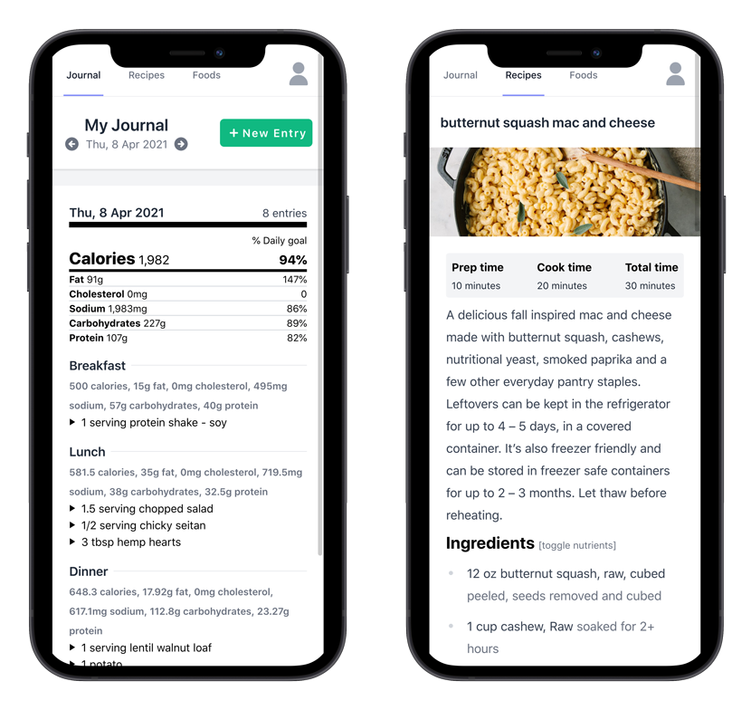

# kcal – the personal food nutrition journal

[](https://opensource.org/licenses/MPL-2.0)
[](https://github.com/kcal-app/kcal/actions/workflows/ci.yml)
[](https://coveralls.io/github/kcal-app/kcal?branch=main)

Track nutritional information about foods and recipes, set goals, and record a food
journal to help along the way. Kcal is a *personal* system that focuses on direct
control of inputs (as opposed to unwieldy user generated datasets) and a minimal, easy
to use recipe presentation for preparing meals.

## Demo

A [demo of kcal](http://demo.kcal.cooking) is available on Heroku. Login credentials are:

- Username: `kcal`
- Password: `kcal`

The demo instance resets every hour, on the hour.

## Screenshots




## Deployment

### Docker

There is a [`Dockerfile`](Dockerfile) and automated build process to create builds
at [kcalapp/kcal](https://hub.docker.com/repository/docker/kcalapp/kcal) on Docker Hub.
See the [kcal-app/kcal-docker](https://github.com/kcal-app/kcal-docker) repository
for a Docker Compose based template and instructions.

### Heroku

[](https://heroku.com/deploy)

The default username and password for a Heroku deployment is `kcal`/`kcal`.

#### Using Heroku CLI

For a manual deploy using Heroku CLI, execute the following after initial deployment:

    heroku run php artisan migrate
    heroku run php artisan user:add
    heroku config:set APP_KEY=$(php artisan --no-ansi key:generate --show)

#### Media storage

Heroku uses an ephemeral disk. In order to maintain recipe and/or user images between
app restarts AWS can be used. See [Media Storage - AWS S3](#aws-s3) for additional
guidance.

#### Search drivers

See the [Search](#search-mag) section for information about supported drivers. Additional
environment variable configuration is necessary when using any search driver other
than the default ("null").

#### Redis Add-on

The [Heroku Redis](https://elements.heroku.com/addons/heroku-redis) add-on can be
added to the app and will work without any configuration changes. It is left out
of the default build only because it takes a very long time to provision.

## Configuration

### Media Storage

Recipes and users can have associated media (images) that by default are stored
on a local disk under the path `{app}/public/media`. If a local disk solution is
not feasible, an AWS S3 bucket can be used instead.

#### AWS S3

Use the general guidance below to create an AWS S3 bucket and IAM user for media
storage in AWS S3.

1. Create a bucket that allows objects to be configured with public access.

1. Create an IAM user with access to the bucket.

    Use this example policy to grant necessary permissions to a specific bucket:

        {
            "Version": "2012-10-17",
            "Statement": [
                {
                   "Sid": "VisualEditor0",
                   "Effect": "Allow",
                   "Action": [
                       "s3:GetBucketPublicAccessBlock",
                       "s3:GetBucketPolicyStatus",
                       "s3:GetAccountPublicAccessBlock",
                       "s3:ListAllMyBuckets",
                       "s3:GetBucketAcl",
                       "s3:GetBucketLocation"
                   ],
                   "Resource": "*"
               },
               {
                   "Sid": "VisualEditor1",
                   "Effect": "Allow",
                   "Action": "s3:ListBucket",
                   "Resource": "arn:aws:s3:::REPLACE_WITH_S3_BUCKET_NAME"
               },
               {
                   "Sid": "VisualEditor2",
                   "Effect": "Allow",
                   "Action": ["s3:*Object", "s3:*ObjectAcl*"],
                   "Resource": "arn:aws:s3:::REPLACE_WITH_S3_BUCKET_NAME/*"
               }
            ]
        }

1. Set necessary environment variables (via `.env` or some other mechanism).

        MEDIA_DISK=s3-public
        AWS_ACCESS_KEY_ID=REPLACE_WITH_IAM_KEY
        AWS_SECRET_ACCESS_KEY=REPLACE_WITH_IAM_SECRET
        AWS_DEFAULT_REGION=REPLACE_WITH_S3_BUCKET_NAME
        AWS_BUCKET=REPLACE_WITH_S3_BUCKET_REGION

### Search :mag:

The "ingredient" (food or recipe) search for journal entries and recipe ingredients
supports three different backends using the `SCOUT_DRIVER` environment variable.
In all cases, always ensure that the `SCOUT_DRIVER` environment variable is only
set once in kcal's `.env` file.

Currently, the food and recipe *list* searches do not take advantage of these
search drivers. Support for those searches will be added if the Laravel JSON:API
adds support for Scout (see: laravel-json-api/laravel#32).

### Algolia (`algolia`)

1. [Create and/or log in](https://www.algolia.com/users/sign_in) to an Algolia account.

1. Create an application for kcal.

1. Navigate to the application's "API Keys" section.

1. Using the **Application ID** and **Admin API Key** values, update kcal's `.env` file:

        SCOUT_DRIVER=algolia
        ALGOLIA_APP_ID=<APPLICATION_ID>
        ALGOLIA_SECRET=<ADMIN_API_KEY>

### ElasticSearch (`elastic`)

1. Determine the ElasticSearch service host and port.

1. Update kcal's `.env` file.

        SCOUT_DRIVER=elastic
        ELASTIC_HOST=<HOST:PORT>
        ELASTIC_PORT=<PORT>

   Note: The `ELASTIC_PORT` variable is a convenience option specifically for
   Docker Compose configurations and is not strictly required.
   
1. Run Elastic's migrations.

        php artisan elastic:migrate

### Fallback (`null`)

The fallback driver is a simple `WHERE ... LIKE` clause search on a couple of key
fields. Results will not be ordered by relevance, and some fields will not be
searched (e.g. the tags fields). Using one of the other options is highly recommended.

Set `SCOUT_DRIVER=null` in kcal's `.env` file to use the fallback driver.

## Development

### Laravel Sail

#### Prerequisites

- [Composer](https://getcomposer.org/download/)
- [Docker](https://docs.docker.com/get-docker/)
- [Docker compose](https://docs.docker.com/compose/install/)

#### Steps

1. Clone the repository.

        git clone https://github.com/kcal-app/kcal.git
        cd kcal

1. Install development dependencies.

        composer install

1. Create a local `.env` file.

        cp .env.local.example .env

1. Generate an app key.

        php artisan key:generate

    Verify that the `APP_KEY` variable has been set in `.env`. If has not, run
    `php artisan key:generate --show` and copy the key and append it to the
    `APP_KEY=` line manually.

1. Run it! :sailboat:

        vendor/bin/sail up

1. (On first run) Run migrations.

        vendor/bin/sail artisan migrate
        vendor/bin/sail artisan elastic:migrate

1. (On first run) Seed the database.

        vendor/bin/sail artisan db:seed

    The default username and password is `kcal` / `kcal`.

Navigate to [http://127.0.0.1:8080](http://127.0.0.1:8080) to log in!

Create a `docker-compose.override.yml` file to override any of the default settings
provided for this environment.

### Testing

Ensure that Sail is running (primarily to provide ElasticSearch):

    vendor/bin/sail up -d

Execute tests.

    vendor/bin/sail artisan test --parallel

#### Caveats

In order to support parallel testing, tests are run using sqlite (even though Sail
provides MySQL). To test with MySQL make a copy of `phpunit.xml.dist` as `phpunit.xml`
and change:

```
<server name="DB_CONNECTION" value="sqlite"/>
<server name="DB_DATABASE" value=":memory:"/>
```

to 

```
<server name="DB_CONNECTION" value="mysql"/>
<server name="DB_HOST" value="db"/>
```

Now running `vendor/bin/sail artisan test` will run tests with MySQL **but** tests
cannot be run in parallel.
